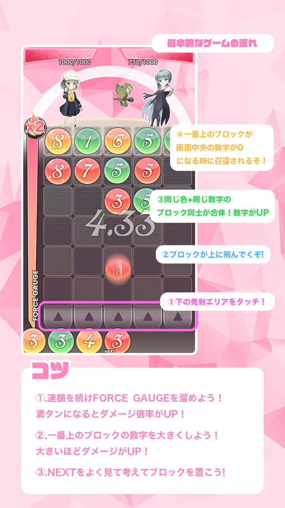

# SummonersPuzzle
ハッカソン系インターンで作ったリアルタイムアクションパズルゲーム「サマナーズパズル」

公開していいとのことだったので公開しました．また，それにあたって使ったリソースの一部をリポジトリから消しています．

エンジニア2名，デザイナー1名で作成．実装期間は1週間ほど．

自分はアウトゲーム全般，インゲームの一部機能・演出を担当しました．

# ゲームルール

1. 画面下部に出てくるモンスターブロックを画面上部にシュートして同じ色+同じランク隣接するモンスターブロックと合体させ，モンスターのランクを上げる​．隣のブロックと合体させる事が可能で，最終的にそれらの合算値がランクになる．
2. 一定時間ごとに画面最上部のモンスターがランクに関係なく召喚される．​ランクが高い程ダメージが高いが，もちろん低いままだと全くダメージを与えられない．
3. 合体させる際にブーストゲージが溜まっていき，​満タンになった際に召喚の際のダメージに倍率がかかる．連鎖させるとゲージがたまりやすくなる．

# デモプレイ
デモプレイは一人プレイのものです．

[動画はこちらから](SummonersPuzzleProject/Demo/DemoPlay.mp4)